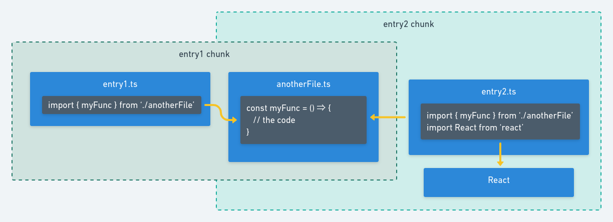

# Create JavaScript

JavaScript in WordPress projects tends to be very distributed, and usually you need another plugin to minimize JS files. In some cases you may want to create reusable modules, then you need to import the file in every page you use that module. After some coding, it becomes hard to manage all that.

Zeus takes care of all these issues, by setting up a NPM project inside `lib` folder, using `webpack` to create optimized bundles.

## How it works

The first thing you need is a entry file. This file will `import` other files, and you may have any number of entry files. All entry files must be listed in `lib/ts/entries.json`. This file is used by `webpack` and the `Assets` controller to create bundles and define which files should be loaded in each page.

## Example

In development environments, add this line to `wp-config.php`:

```php
<?php
define("ZEUS_ALWAYS_CHECK_CHUNKS", true);
```

This will make `Assets` controller update the file references in every load (but reduces performance).

### Create the entry

To create a script that will run only on Single Post page. First, we need to edit `lib/ts/entries.json`:

```json
{
    "entries": [
        "single-post.ts"
    ]
}
```

Webpack, will look into `lib/ts` folder for a `single-post.ts` file during build. So, let's create that file:

 - `lib/ts/single-post.ts`

```ts
import PostModel from './models/Post';

(($) => {
    $(window).on('load', () => {
        const id: number = data.postId;
        const post = new PostModel(id);
        post.doSomething();
    });
})(jQuery);
```

 > PostModel will not be covered in this example.

Note that we used a variable `data`, which the value should be parsed by PHP. We will look into that later. After creating the file, we must build the project.

### Building for development

 > All commands in this documentation should be executed in `lib` folder.

```
npm run build-dev
```

If you will develop continuously, you can use the `start` script to make a build when any file changes.

```
npm run start
```

A `single-post.bundle.js` file should be created in the folder `includes/js`. At this point, the file will not be loaded. We need to tell `Assets` controller to load the file in the single post page, by using the filter `zeus_enqueues_{$entry_name}`:

 - `src/Controllers/Assets.php`

```php
<?php

class Assets {
    // {{...}}

    public function run() {
        // {{...}}
        add_filter("zeus_enqueues_single-post", function () {
            return is_single();
        });
        // {{...}}
    }
}
```


The file should now be loaded into the single post page.

### Add variables to the script

Use the `addVar` method to add the value you need. Add these lines iniside a function hooked into `wp_enqueue_scripts`:

```php
<?php
// verification to avoid unnecessary calls.
if (true === apply_filters("zeus_enqueues_single-post", false)) {
    // adds variable to script
    zeus()->assets->addVar("single-post", "data", [
        "postId" => get_the_ID(),
    ]);
}
```

 > The function running in `wp_enqueue_scripts` should have priority below 20.

## Building production

To get a production build, run:

```
npm run build
```



This type of build will create chunks, which will be any combination of imported files or `node_modules` you install. Zeus uses the `chunks-webpack-plugin`, which generates the file `includes/js/{$entry_name}-scripts.html` with script tags, that could look like this:

```html
<script src="/../includes/js/single-post.bundle.js"></script>
<script src="/../includes/js/235.bundle.js"></script>
<script src="/../includes/js/710.bundle.js"></script>
<!-- Any number of scripts will appear here, depending on the project size -->
```

For performance reasons, this file is only read when the plugin version changes. So, it is required to update the `PLUGIN_VERSION` constant in the main `App` class.

```php
<?php

class App
{
    const PLUGIN_VERSION = "1.0.1";
}
```
